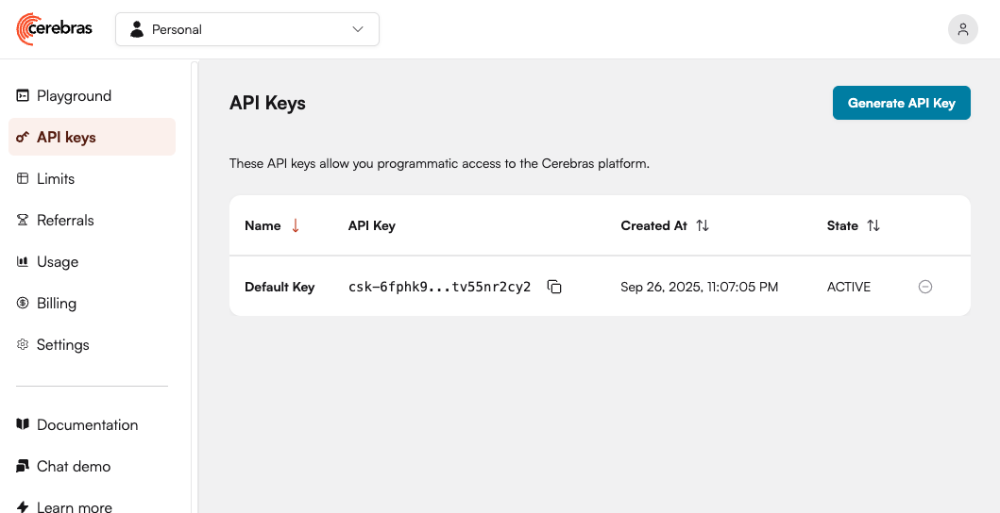
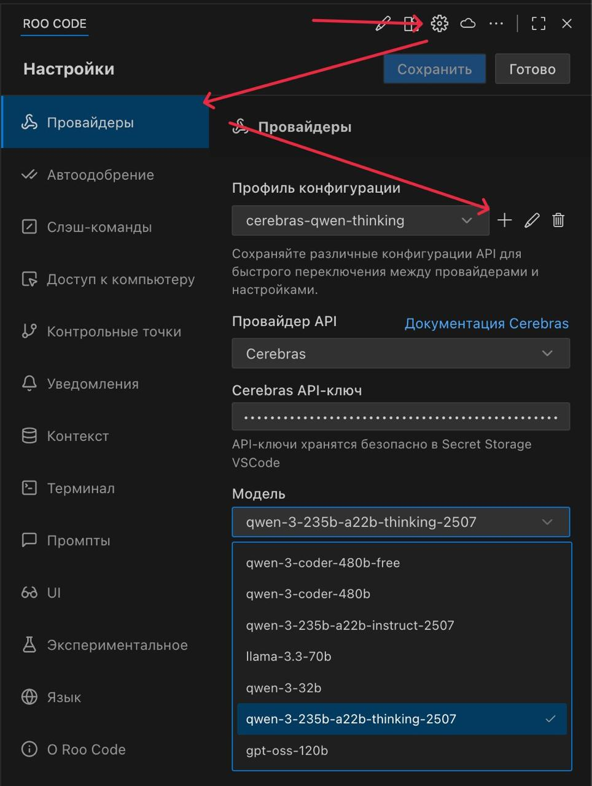

# Мастер-класс по исследованию ИИ-агентов на примере калькулятора

На данном мастер-классе мы будем исследовать возможности ИИ-агентов для работы с кодом на примере веб-калькулятора с REST API. Будем писать запросы, изучим код, посмотрим тесты в живую всё на примере плагина Roo Code для общения с ИИ и предоставления доступа к коду проекта.
Важно, что результат у нас не фиксированный, и мы попробуем сделать сколько успеем, но в любом случае выложу все базовые задания сюда.

## Оглавление

- [Подготовка и настройка окружения](#подготовка-и-настройка-окружения)
  - [1. Настройка VSCode и RooCode](#1-настройка-vscode-и-roocode)
  - [2. Получение кода проекта](#2-получение-кода-проекта)
  - [3. Настройка окружения проекта](#3-настройка-окружения-проекта)
- [Задания для мастер-класса](#задания-для-мастер-класса)
- [Дополнительная информация](#дополнительная-информация)

## Подготовка и настройка окружения

### 1. Настройка VSCode и RooCode

1. Установите [VSCode](https://code.visualstudio.com/)
2. Установите [RooCode](https://marketplace.visualstudio.com/items?itemName=RooVeterinaryInc.roo-cline) - обязательное расширение для работы с ИИ-агентами
3. (Опционально) Установите рекомендуемые VSCode расширения для Python

#### Настройка моделей в RooCode
Для демонстрации используется предоставляющий доступ к разным ИИ-моделям сервис Cerebras AI с большими квотами — https://cloud.cerebras.ai/

1. Зарегистрируйтесь на сервисе и создайте организацию
2. В меню API Keys создайте и скопируйте ключ доступа
    
3. В VSCode откройте настройки RooCode (вкладка "Провайдеры")
4. Создайте новый профиль конфигурации:
    - Провайдер API: Cerebras
    - Cerebras API-ключ: вставьте скопированный ключ
    - Модель: выберите любую, кроме qwen-3-coder-480b (qwen-3-coder-480b-free можно). Для мастер-класса рекомендую завести несколько моделей, как минимум qwen-...-thinking..., qwen-...-instruct..., qwen-3-coder-480b-free
    

### 2. Получение кода проекта

1. Проверьте установлен ли Git, набрав в консоли:
    ```bash
    git --version
    ```

    Если нет — [установите git](https://git-scm.com/downloads).

2. Клонируйте репозиторий с проектом:

    ```bash
    git clone https://github.com/fortrest-jr/sqa37-calc-task.git
    cd sqa37-calc-task
    ```


### 3. Настройка окружения проекта
Выполняется после клонирования репозитория, в созданной папке.

1. Убедитесь, что у вас установлен uv, набрав в консоли:
    ```bash
    uv --version
    ```
    Если нет, [установите uv](https://docs.astral.sh/uv/getting-started/installation/)

2. Установите зависимости:
    ```bash
    uv python install
    uv venv
    uv pip install -r requirements.txt
    ```

3. Откройте в VSCode папку проекта:
    ```bash
    code .
    ```

## Задания для мастер-класса

Все задания выполняются в плагине Roo Code в VSCode.

Следите за размышлениями модели и останавливайте, если что-то идёт не так, например модель путается или думает о чём-то не том.
Вполне нормально писать уточняющие сообщения в любой момент размышлений.

Рекомендую при личном выполнении заданий работать в Sourcecraft (описан в доп инфо) — так лучше усвоится процесс размышлений и взаимодействия с моделью без лишней спешки.

1. Узнать что за проект у нас открыт.
    * Изучите проект в целом
    * Изучите фичу округления
        * Попробуйте сразу передать или указать измененные файлы из [ПР](https://github.com/fortrest-jr/sqa37-calc-task/pull/2/files), это поможет экономить контекст
        * Задайте уточняющие вопросы. Попробуйте найти несоответствия в логике или неявное поведение

            Базовый промпт в режиме Ask, модель thinking или instruct: `Расскажи про фичу округления`
    * Попробуйте изучить и другие фичи проекта

2. Изучить автотесты проекта
    * Изучить какие тесты есть и какие тестовые сценарии проверяются

        Базовый промпт в режиме Ask, модель thinking или instruct: `Какие тесты есть в проекте`
    * Узнать как запустить тесты и выполнить их при помощи ИИ-агента
    
        Базовый промпт в режиме Ask, модель thinking или instruct: `Как запустить тесты?`
    
        Базовый промпт 2, режим/модель не важны: `Запусти тесты`
    * Проанализируйте сценарий каждого упавшего теста и выясните причину падения

        Базовый промпт в режиме Ask, модель thinking или instruct: `Расскажи про тест {подставить название теста}`

        Базовый промпт2 в режиме Ask, модель thinking или instruct: `Почему он падает с ошибкой {подставить текст ошибки}`

        * Примите решение: нужно заводить баг / нужно уточнять у разработки / можно починить тест самому
        * Почините что получится и запустите для проверки успешного прохождения теста

            Базовый промпт в режиме Code, модель coder: `Внеси изменения в код для исправления теста`

3. Покрыть тестами
    * Покрыть тестами api фичи округления

        Базовый промпт в режиме Architect, модель thinking или instruct: `Запланируем покрытие тестами api фичи округления`

        Базовый промпт 2 в режиме Code, модель coder: `Прочитай план из файла @{имя файла} и реализуй его`
        * Проверить результат в режиме Ask, нужно использовать модель не учавствовавшую в планировании и кодинге. Можно спросить оценку несколько раз и попросить выявить потенциальные проблемы.
    * Покрыть тестами api фичу истории
    


## Дополнительная информация
* Sourcecraft — Альтернатива RooCode от Яндекса с мощной бесплатной квотой: https://sourcecraft.dev/portal/code-assistant/, результат работы ИИ мне нравится больше, но скорость ниже, поэтому для работы на самом мастер-классе рекомендую всё же Cerebras.
* Альтернатива VSCode, если нет возможжности настроить: IDE прямо в браузере https://replit.com/
    * Мастер-класс можно ремикснуть тут: https://replit.com/@arssobolev/sqa37-calc-task
    
        Там будут большие отличия от VSCode но вы примерно сможете попробовать то же, что будет на мастер-классе.
* Как настроить memory-bank для roo coode: https://github.com/GreatScottyMac/roo-code-memory-bank/tree/main — очень полезный инструмент для экономии контекста и времени, особенно на больших проектах.